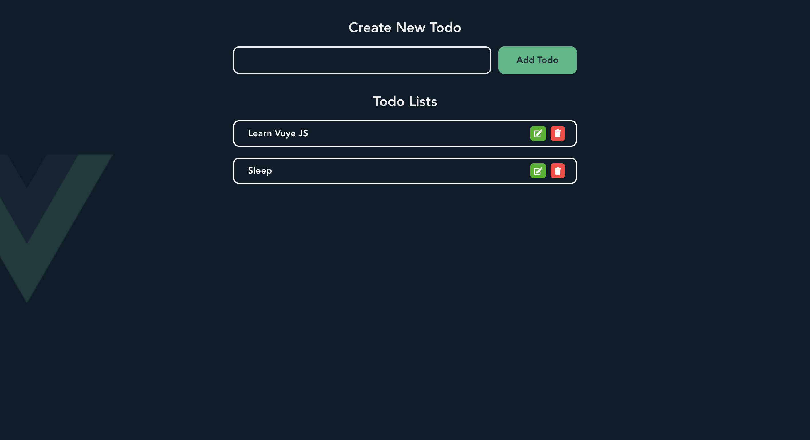

# Vue Todo-app



## Description
Learning Vue Js 3 implementing new Vue Composition 3 API & State management with Vuex.
For the data storage i'm using JSONPlaceholder server.

## Project setup
```
npm install
```

### Run JSONPlaceholder Server as DB
```
npm run watch
```

### Compiles and hot-reloads for development
```
npm run serve
```

### Compiles and minifies for production
```
npm run build
```

### Lints and fixes files
```
npm run lint
```

### Customize configuration
See [Configuration Reference](https://cli.vuejs.org/config/).
